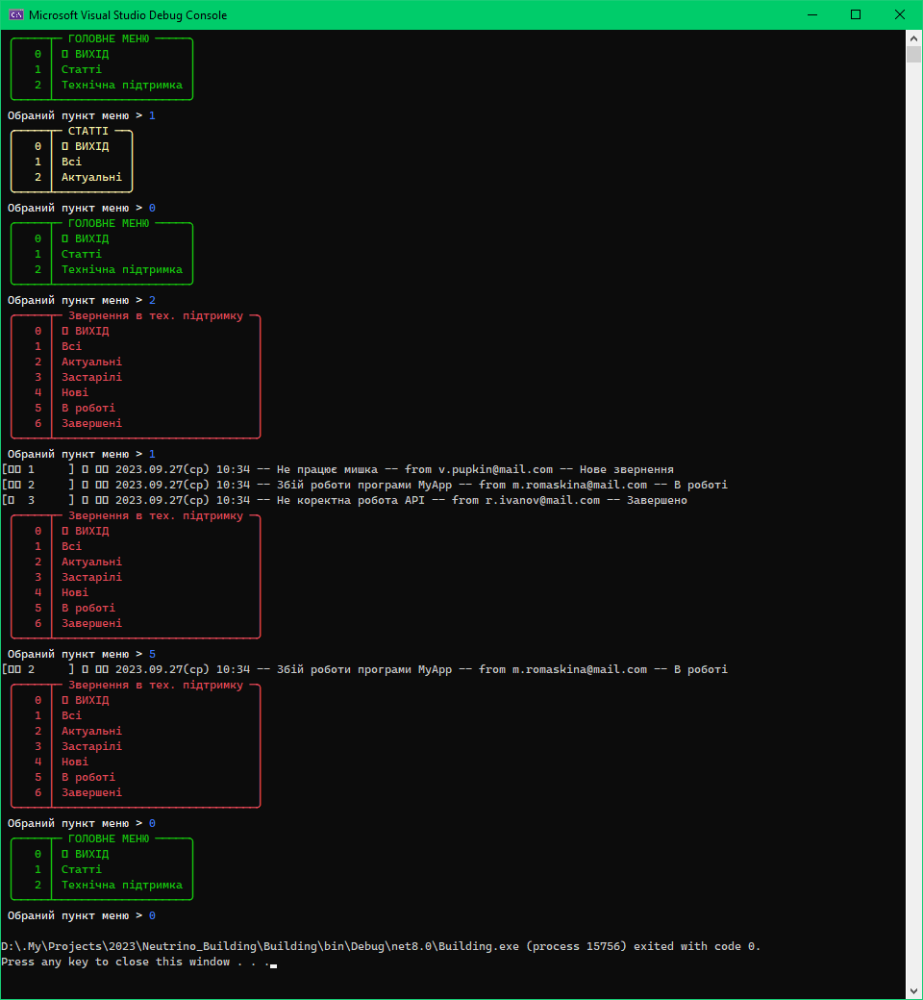

[🔝 Головна](./Readme.md)

`🕗 Оновлено` 2023.09.27(Вт) 10:40


# Як реалізувати ваш функціонал

Для реалізації додаткового функціоналу створено базові класи `Entity` та `EntitySet` від яких необхідно зробити наслідування:
Для прикладу будемо створювати звернення в технічну службу (техпідтримка).

Місця в програмі куди я додаю повязаний код буду виділяти таким чином:

```Cs
#region #Support

// код

#endregion #Support
```

> 1. Наше звернення буде мати декілька статусів, для чого додамо новий перелік `ESupportTicketState`:
```Cs
// DataModel/Support/ESupportTicketState.cs

#region #Support
namespace Building;

/// <summary> Стан звернення в технічну службу </summary>
public enum ESupportTicketState
{
    /// <summary> Нове </summary>
    New,
    /// <summary> В роботі </summary>
    InProgres,
    /// <summary> Завершене </summary>
    Closed
}
#endregion #Support
```

> 2. Так як ми будемо використовувати наш перелік для відображення стану звернення використовуючи ToString() самого звернення - створимо метод розширення, який буде надавати нам назву стану в зручному форматі:
```Cs
// DataModel/Support/ExtESupportTicketState.cs

#region #Support
using E = Building.ESupportTicketState;
namespace Building;

public static class ExtESupportTicketState
{
    public static String AsStr(this E enumValue) => _namesOfEnum[enumValue];

    private static readonly Dictionary<E, String> _namesOfEnum;
    
    static ExtESupportTicketState()
    {
        _namesOfEnum = new Dictionary<E, String>();
        Registration(E.New, "Нове звернення");
        Registration(E.InProgres, "В роботі");
        Registration(E.Closed, "Завершено");
    }

    private static void Registration(E enumValue, String name) => _namesOfEnum.Add(enumValue, name);
}
#endregion #Support
```  

> 3. Створимо клас звернення, використовуючи наслідування від `Entity`:
```Cs
// DataModel/Support/SupportTicket.cs

#region #Support
namespace Building;

/// <summary> Звернення в тех. підтримку </summary>
public class SupportTicket : Entity
{
    /// <summary> Дата створення звернення </summary>
    public DateTime CreationTime { get; private set; }

    /// <summary> Стан звернення </summary>
    public ESupportTicketState State { get; set; } = ESupportTicketState.New;

    /// <summary> Стисла назва звернення </summary>
    public required String Title { get; init; }

    /// <summary> Email автора </summary>
    public required String AutorEmail { get; init; }

    /// <summary> Текст звернення </summary>
    public required String Text { get; init; }

    /// <summary> Конструктор, що наслідуєься від базового </summary>
    /// <param name="id"></param>
    public SupportTicket(Int32 id, DateTime creationTime) : base(id)
        => CreationTime = creationTime;

    /// <summary> Перевантажений конструктор в якому автоматично заповнюється дата створення </summary>
    /// <param name="id"></param>
    public SupportTicket(Int32 id) : base(id)
        => CreationTime = DateTime.Now;

    /// <summary> Перевизначимо необхідним чином приведення до стрічки </summary>
    public override String ToString()
        => $"{base.ToString()} 📝 {CreationTime:yyyy.MM.dd(ddd) HH:mm} -- {Title} -- from {AutorEmail} -- {State.AsStr()}";
}

#endregion #Support
```

> 4. Створимо клас для роботи з набором звернеть, використовуючи наслідування від `EntitySet<SupportTicket>`:
```Cs
// DataModel/Support/SetOfSupportTickets.cs

#region #Support
namespace Building;

public class SetOfSupportTickets : EntitySet<SupportTicket>
{
    /// <summary> В конструкторі опишемо пункти меню, що будуть використовуватись в розділі Тех. підтримка </summary>
    /// <param name="id"> Id </param>
    /// <param name="name"> Назва (набору звернень) </param>
    public SetOfSupportTickets(Int32 id, String name) : base(id, name)
    {
        // Для вашого меню можна задати власний колір, напририклад червоний
        Menu = new("Звернення в тех. підтримку", ConsoleColor.Red)
        {
            new (1, "Всі"),
            new (2, "Актуальні"),
            new (3, "Застарілі"),
            new (4, "Нові"),
            new (5, "В роботі"),
            new (6, "Завершені"),
        };
    }

    protected override EWorkWithMenu HandleMenuChoice(Int32 menuItemNumber)
    {
        switch(menuItemNumber)
        {
            case 0:
                return EWorkWithMenu.QuitMenu;

            case 1:
                this.ForEach(e => Console.WriteLine(e));
                return EWorkWithMenu.ContinueWork;

            case 2:
                this.Where(e => e.Actuality == EActuality.Actual).ForEach(e => Console.WriteLine(e));
                return EWorkWithMenu.ContinueWork;

            case 3:
                this.Where(e => e.Actuality == EActuality.Deprecated).ForEach(e => Console.WriteLine(e));
                return EWorkWithMenu.ContinueWork;

            case 4:
                this.Where(e => e.State == ESupportTicketState.New).ForEach(e => Console.WriteLine(e));
                return EWorkWithMenu.ContinueWork;

            case 5:
                this.Where(e => e.State == ESupportTicketState.InProgres).ForEach(e => Console.WriteLine(e));
                return EWorkWithMenu.ContinueWork;

            case 6:
                this.Where(e => e.State == ESupportTicketState.Closed).ForEach(e => Console.WriteLine(e));
                return EWorkWithMenu.ContinueWork;
        }
        return base.HandleMenuChoice(menuItemNumber);
    }
}
#endregion #Support
```

> 5. Основна частина нашого функціоналу готова, додамо його в головне меню:


```Cs
// DataModel/MainMenu.cs

namespace Building;

public class MainMenu
{
    private Menu Menu { get; set; }

    public required SetOfArticles Articles { get; init; }

#region #Support
    /// <summary> Звернення в тех. підтримку </summary>
    public required SetOfSupportTickets SupportTickets { get; init; }
#endregion #Support

    public MainMenu()
    {
        Menu = new("ГОЛОВНЕ МЕНЮ", ConsoleColor.Green)
        {
            // 0 - Вихід додається автоматично
            new (1, "Статті"),
#region #Support
            new (2, "Технічна підтримка")
#endregion #Support
            // new (2, "Ваш пункт меню"), // Додайте ваш пункт меню
        };

    }

    public void ShowMenu()
    {
        EWorkWithMenu workWithMenu = EWorkWithMenu.QuitMenu;
        do
        {
            try
            {
                workWithMenu = HandleMenuChoice(Menu.ShowMenu());
            }
            catch(Exception ex)
            {
                ExtConsole.ShowError(ex.Message);
            }

        } while(workWithMenu == EWorkWithMenu.ContinueWork);
    }

    public EWorkWithMenu HandleMenuChoice(Int32 menuItemNumber)
    {
        switch(menuItemNumber)
        {
            case 0:
                return EWorkWithMenu.QuitMenu;
            case 1:
                Articles.ShowMenu();
                return EWorkWithMenu.ContinueWork;
#region #Support
            case 2:
                SupportTickets.ShowMenu();
                return EWorkWithMenu.ContinueWork;
#endregion #Support
        }
        return EWorkWithMenu.QuitMenu;
    }
}
```

> 6. І, на решті, наповнимо розділ із зверненнями:

```Cs
// Program.cs

using System.Text;

namespace Building;

internal class Program
{
    static void Main(String[] args)
    {
        Console.InputEncoding = Encoding.Unicode;
        Console.OutputEncoding = Encoding.Unicode;

        SetOfArticles articles = new(1, "Статті") 
        {
            new (1) { Title = "Стаття 1", Actuality = EActuality.Deprecated },
            new (34) { Title = "Стаття 2" }
        };

#region #Support
        SetOfSupportTickets supportTickets = new (2, "Технічна підтримка")
        {
            new (1)
            {
                Title = "Не працює мишка",
                Actuality = EActuality.Actual,
                AutorEmail = "v.pupkin@mail.com",
                Text = "Перестала працювати мишка. Можливо ...", 
                State = ESupportTicketState.New                
            },
            new (2)
            {
                Title = "Збій роботи програми MyApp",
                Actuality = EActuality.Actual,
                AutorEmail = "m.romaskina@mail.com",
                Text = "Мій додаток перестав працювати в зв'язку із ...",
                State = ESupportTicketState.InProgres
            },
            new (3)
            {
                Title = "Не коректна робота API",
                Actuality = EActuality.Deprecated,
                AutorEmail = "r.ivanov@mail.com",
                Text = "Мій додаток перестав працювати в зв'язку із змінами у вашому API, що були...",
                State = ESupportTicketState.Closed
            }
        };
#endregion #Support

        MainMenu mainMenu = new()
        {
             Articles = articles,
#region #Support
             SupportTickets = supportTickets
#endregion #Support
        };

        mainMenu.ShowMenu();
    }
}
```

Все, наші зміни готові, програму можна запускати:

